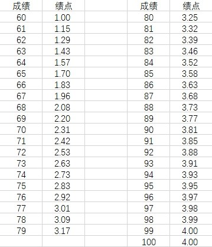
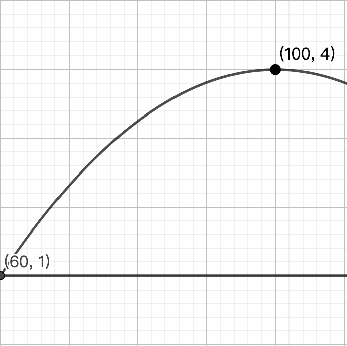

### 写给新生

刚刚入学的你们或许有点焦头烂额，可能已经听过了很多学长学姐在大一上学期绩点爆炸的故事。你们可能心里未免有些疑惑:"这难道不是好好学习就能解决的事情吗？"但这个问题远远没有这么简单，在我们讨论如何避免/减少适应期带来的负面影响之前，我想先带大家了解一下绩点算法。

#### 绩点算法

设$$y$$为GPA，$$x$$为百分制成绩，$$y$$与$$x$$满足如下的函数关系:

$$
y = -\frac{3}{1600}(x-100)^2+4
$$

上面这张图或许不够直观，我们来看这张图:

有没有注意到什么？没错，这段连续的二次函数有一个很吓人的性质: 分数越低，GPA下降越快！这也是我写这篇文章的一个原因。与清华、浙大等学校相比，北大的绩点制度似乎过于神奇。对于大部分人来说，花大力气卷一个高分并不是一件非常值得的事情，因为分数越高，GPA上升的越慢。但又不能太过松懈，低分带来的绩点急速下降是很致命的。在这种情况下，根据个人能力去选择一个合适的、性价比较高的学习策略是重要的。

